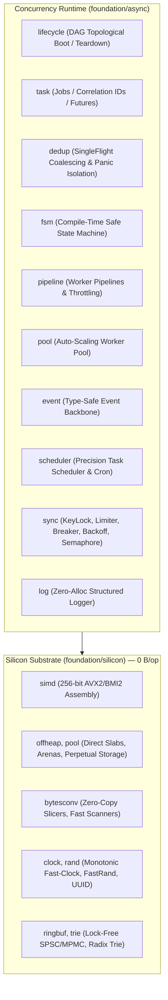

# Architecture & Engineering Manifesto

> **Core Manifesto**:
> *"The moment bytes leave CPU registers and touch RAM or network buffers, it happens with 0 allocations, at silicon line speed, with zero type drift, and absolute architectural clarity."*

`foundation` is a unified, high-performance silicon substrate and tactical concurrency runtime for Go. It consolidates hardware-accelerated memory and SIMD primitives with industrial-grade service orchestration into a single, cohesive foundation following the Apple-style vertical integration paradigm.

## Architectural Decomposition

### Pillar 1: `silicon/` (Hardware Substrate)
* **Design Goal**: Nanosecond compute, zero garbage collection overhead, direct register utilization.
* **Constraints**: Zero external dependencies, pure standard Go runtime + PLAN9 Go Assembly, zero heap allocations on hot paths.

### Pillar 2: `async/` (Tactical Concurrency Runtime)
* **Design Goal**: Orchestrating millions of goroutines, DAG service lifecycles, type-safe events, and resilient synchronization without race conditions or memory leaks.
* **Constraints**: Generics-first (`[T any, K comparable]`), context-aware cancellation, panic boundary isolation, zero reflection in hot execution loops.

## Package Directory Layout

| Domain | Submodule | Documentation | Purpose |
| :--- | :--- | :--- | :--- |
| **`silicon/`** | `simd` | [`docs/silicon/SIMD.md`](silicon/SIMD.md) | 256-bit AVX2/BMI2 vector processing (81.7 GB/s masking). |
| | `bytesconv` | [`docs/silicon/BYTESCONV.md`](silicon/BYTESCONV.md) | Zero-copy string/slice conversions, fast scanning and slicing. |
| | `offheap` | [`docs/silicon/OFFHEAP.md`](silicon/OFFHEAP.md) | Direct unmanaged memory slabs avoiding Go GC overhead. |
| | `pool` | [`docs/silicon/POOL.md`](silicon/POOL.md) | Multi-tiered memory arenas, perpetual byte storage, object pools. |
| | `ringbuf` | [`docs/silicon/RINGBUF.md`](silicon/RINGBUF.md) | Lock-free SPSC / MPMC ring buffers and Structure-of-Arrays (SoA). |
| | `clock`, `rand` | [`docs/silicon/CLOCK_AND_RAND.md`](silicon/CLOCK_AND_RAND.md) | Monotonic fast-clock and lock-free fast pseudo-random / UUID v4/v7. |
| | `trie` | [`docs/silicon/TRIE.md`](silicon/TRIE.md) | Zero-allocation prefix and radix search trees. |
| **`async/`** | `lifecycle` | [`docs/async/LIFECYCLE.md`](async/LIFECYCLE.md) | Topologically sorted DAG service boot and background loop runners. |
| | `event` | [`docs/async/EVENT.md`](async/EVENT.md) | Type-safe non-blocking event bus with reflection-free dispatch. |
| | `task` | [`docs/async/TASK.md`](async/TASK.md) | Asynchronous task tracking with Correlation IDs and Futures. |
| | `dedup` | [`docs/async/DEDUP.md`](async/DEDUP.md) | SingleFlight request deduplication with isolated panic propagation. |
| | `fsm` | [`docs/async/FSM.md`](async/FSM.md) | Strongly typed finite state machines with transactional rollback. |
| | `pipeline` | [`docs/async/PIPELINE.md`](async/PIPELINE.md) | Concurrent mapping pipelines with rate-limiting and fan-out/fan-in. |
| | `pool` | [`docs/async/POOL.md`](async/POOL.md) | Dynamic auto-scaling goroutine worker pool with futures. |
| | `scheduler` | [`docs/async/SCHEDULER.md`](async/SCHEDULER.md) | Microsecond-precision recurring task schedulers and cron runners. |
| | `sync` | [`docs/async/SYNC.md`](async/SYNC.md) | Striped key-based locks, Vegas limiters, breakers, backoff, and semaphores. |
| | `log` | [`docs/async/LOG.md`](async/LOG.md) | High-performance zero-allocation structured logger facade. |
