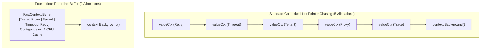

# High-Performance Flat-Array Context (`async/ctxkit`)

[](https://pkg.go.dev/github.com/lemon4ksan/foundation/async/ctxkit)

`async/ctxkit` provides an ultra-high-performance, flat-array implementation of `context.Context` designed for high-throughput request pipelines, 100% standard library interoperability, and generic type-safe value retrieval.

## 1. Motivation & The Hidden Cost of Standard `context.Context`

The standard library `context.WithValue` is one of the most pervasive yet hidden memory and CPU bottlenecks in Go backend services and networking engines.

### The Architectural Problem in Standard Go:
1. **O(N) Linked-List Pointer Chasing**: Every `context.WithValue(ctx, key, val)` allocates a new `valueCtx` node wrapping its parent. In a microservice or HTTP client with 5–8 middleware layers (Tracing, Auth, Proxy, Timeout, Tenant, Retry, Cache), looking up a key requires traversing a deeply nested chain of pointers across the heap, triggering CPU L1/L2 cache misses.
2. **Interface Boxing Allocations**: Each call requires boxing `key any` and `value any`, forcing **2 heap allocations per middleware stage** and multiplying Garbage Collector (GC) pressure under high RPS.
3. **Runtime Type-Cast Fragility**: Reading values requires unsafe runtime type assertions `val, ok := ctx.Value(k).(MyType)`, which risk runtime panics or silent bugs on mismatch.

## 2. Memory Architecture & Mechanics

`Context` replaces the heap-allocated linked list with a **contiguous, flat inline array buffer**.



### Memory Layout Comparison

| Feature | Standard Library `context.Context` | Foundation `async/ctxkit.FastContext` |
| :--- | :--- | :--- |
| **Data Structure** | Singly-linked list of `valueCtx` structs | Contiguous flat array (`[8]kvEntry` inline buffer) |
| **Memory Locality** | Dispersed throughout heap memory | Packed in a single CPU cache line |
| **Lookup Complexity** | O(N) pointer traversals | O(K) linear scan within contiguous L1 cache |
| **Allocations (5 Writes)**| **5 heap allocations (240 bytes)** | **0 heap allocations (0 B/op)** |
| **Type Safety** | Dynamic runtime cast `.(any)` | Strict generic `generic.Optional[T]` |
| **Interoperability** | Standard `context.Context` | **100% compliant `context.Context`** |

## 3. Empirical Benchmarks

Benchmarks executed on **12th Gen Intel(R) Core(TM) i5-12400F** (Go 1.25.4):

```bash
go test -bench="PipelineLifecycle" -benchmem -count=3 ./async/ctxkit
```

### Real-World Pipeline Scenario (5 Middleware Writes -> 5 Engine Reads)

| Implementation | Execution Speed | Memory Allocated | Heap Allocations |
| :--- | :---: | :---: | :---: |
| **Standard `stdctx.Context`** | `175.1 ns/op` | `240 B/op` | `5 allocs/op` |
| **`Context.InPlace`** | **`117.6 ns/op`** *(~33% faster)* | **`0 B/op`** | **`0 allocs/op`** |
| **`Context.Pool`** *(with recycling)* | **`137.2 ns/op`** | **`0 B/op`** | **`0 allocs/op`** |

> [!TIP]
> Under a server load of **500,000 requests/sec**, standard Go allocates **~120 MB/sec** and **2.5 million objects/sec** solely for context metadata. `Context` drops this memory footprint and GC churn to **absolute zero**.

## 4. Usage & Ergonomics

### Seamless Ingress Conversion (100% Transparent)

Convert standard incoming contexts at the pipeline boundary. Downstream handlers can pass `Context` anywhere a standard `context.Context` is accepted:

```go
package main

import (
    "net/http"

    ctxkit "github.com/lemon4ksan/foundation/async/ctxkit"
)

func IngressMiddleware(next http.Handler) http.Handler {
    return http.HandlerFunc(func(w http.ResponseWriter, r *http.Request) {
        // Wrap standard context once at ingress:
        fastCtx := ctxkit.Wrap(r.Context())
        next.ServeHTTP(w, r.WithContext(fastCtx))
    })
}
```

### Type-Safe Generic Extraction (`ctxkit.Get[T]`)

Eliminate dangerous `.(any)` type assertions and boilerplate `if !ok` branches:

```go
type TraceInfo struct {
    TraceID string
    SpanID  string
}

// 1. Write value
ctx = ctxkit.WithValue(ctx, "trace_key", TraceInfo{TraceID: "abc-123", SpanID: "span-456"})

// 2. Read with Swift-like Optional monad:
traceOpt := ctxkit.Get[TraceInfo](ctx, "trace_key")
if trace, ok := traceOpt.Value(); ok {
    fmt.Println("Trace ID:", trace.TraceID)
}

// 3. Read with fallback default:
tenantID := ctxkit.GetOr[string](ctx, "tenant_key", "default-tenant")
```

### In-Place Zero-Allocation Enrichment

For single-goroutine request lifecycles and middleware chains:

```go
func EnrichRequestContext(ctx *ctxkit.FastContext) {
    // Zero allocations across all mutations:
    ctx.Set("auth_token", "jwt-header-xyz")
    ctx.Set("retry_count", 3)
    ctx.Set("is_premium", true)
}
```

### Recycled Context Pool (`ctxkit.NewPool`)

For extreme RPS pipelines and network protocol drivers (QUIC/H3/TCP):

```go
var contextPool = ctxkit.NewPool()

func HandleConnection(parent context.Context) {
    ctx := contextPool.Acquire(parent)
    defer contextPool.Release(ctx)

    ctx.Set("conn_id", 9876)
    // Execute connection lifecycle...
}
```
