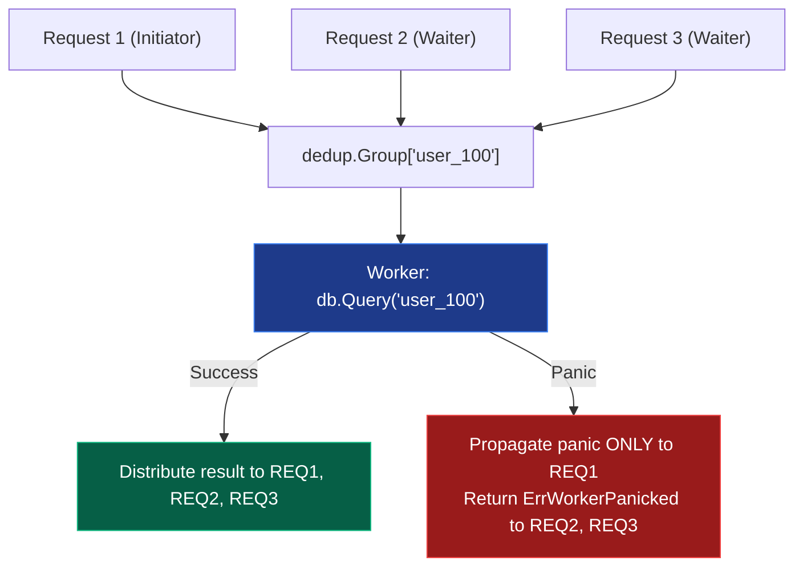

# Request Deduplication (`async/dedup`)

[](https://pkg.go.dev/github.com/lemon4ksan/foundation/async/dedup)

`async/dedup` coordinates concurrent executions for identical parameterized keys, ensuring expensive operations execute exactly once while providing isolated panic boundaries and context cancellation safety.

## Motivation & Problem Context

Under peak traffic spikes, concurrent cache misses on identical resource keys can trigger a cache stampede, overwhelming backend databases with redundant queries. While single-flight deduplication coalesces these in-flight requests into a single execution, standard implementations suffer from severe panic cascades: an unhandled panic in the primary worker re-panics across every waiting caller simultaneously. A robust deduplication layer must isolate runtime panics exclusively to the initiating caller while safely returning structured errors to secondary waiters.

## Comparison

### Standard Implementation (Unsafe Panics & Manual State)

```go
var (
    mu       sync.Mutex
    inflight = map[string]*call{}
)

type call struct {
    wg  sync.WaitGroup
    val *User
    err error
}

func fetchUser(key string) (*User, error) {
    mu.Lock()
    if c, ok := inflight[key]; ok {
        mu.Unlock()
        c.wg.Wait()
        return c.val, c.err
    }
    c := &call{wg: sync.WaitGroup{1}}
    inflight[key] = c
    mu.Unlock()

    c.val, c.err = db.Query(key) // Panic here crashes ALL waiting callers!
    c.wg.Done()

    mu.Lock()
    delete(inflight, key)
    mu.Unlock()
    return c.val, c.err
}
```

### Foundation Implementation (Isolated Panic Boundary)

```go
group := &dedup.Group[string, *User]{}

// Only the initiating caller receives the panic; secondary waiters receive ErrWorkerPanicked
user, err := group.Do(ctx, "user_100", func(workerCtx context.Context) (*User, error) {
    return db.Query(workerCtx, "user_100")
})
```

## Architecture & Mechanics



### Panic Boundary Protocol
1. When worker execution panics, an internal `recover()` intercepts the panic value.
2. The panic is re-thrown **only on the initiator goroutine**.
3. All other waiting goroutines receive a clean `dedup.ErrWorkerPanicked`, preventing cascading outages.
4. Completed keys are automatically swept from the internal map immediately.

## Practical Recipes

### 1. Cache Stampede Protection

*Rationale*: Protects cache-miss lookup paths from overloading backend databases during traffic spikes.

```go
package main

import (
	"context"
	"fmt"
	"time"

	"github.com/lemon4ksan/foundation/async/dedup"
)

type Product struct {
	SKU   string
	Price float64
}

var productDedup = &dedup.Group[string, *Product]{}

func GetProduct(ctx context.Context, sku string) (*Product, error) {
	if p := cacheGet(sku); p != nil {
		return p, nil
	}

	return productDedup.Do(ctx, sku, func(workerCtx context.Context) (*Product, error) {
		if p := cacheGet(sku); p != nil {
			return p, nil
		}

		time.Sleep(50 * time.Millisecond) // Expensive DB query
		p := &Product{SKU: sku, Price: 199.99}
		cacheSet(sku, p)
		return p, nil
	})
}
```

### 2. Asynchronous `DoChan` Pipeline

*Rationale*: When callers need a response channel instead of blocking the current thread.

```go
func HandleAsyncLookup(ctx context.Context, key string) <-chan dedup.Result[*Product] {
	return productDedup.DoChan(ctx, key, func(workerCtx context.Context) (*Product, error) {
		return fetchRemoteProduct(workerCtx, key)
	})
}
```
