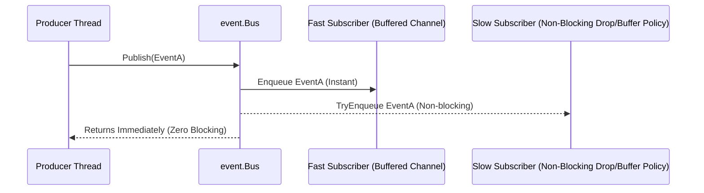

# Asynchronous Event Backbone (`async/event`)

[](https://pkg.go.dev/github.com/lemon4ksan/foundation/async/event)

`async/event` is an ultra-high-throughput, type-safe asynchronous event bus with non-blocking delivery and reflection-free typed subscription channels.

## Motivation & Problem Context

Decoupling publishers from subscribers in concurrent systems requires careful lifecycle and backpressure management. Untyped event interfaces (`any`) eliminate compile-time type checking and push assertion failures to runtime. Meanwhile, synchronous event buses allow a single slow subscriber to block the producer thread, propagating latency throughout the entire application.

## Comparison

### Standard Implementation (Reflection Matching & Producer Contention)

```go
type Bus struct {
    mu   sync.RWMutex
    subs map[reflect.Type][]chan any
}

func (b *Bus) Publish(ev any) {
    b.mu.RLock()
    defer b.mu.RUnlock()
    t := reflect.TypeOf(ev)
    for _, ch := range b.subs[t] {
        ch <- ev // Blocks producer if subscriber buffer is full
    }
}
```

### Foundation Implementation (Type-Safe & Non-Blocking)

```go
bus := event.New()
defer bus.Close()

// Type-safe subscription channel
sub := bus.Subscribe(OrderCreatedEvent{})
defer sub.Unsubscribe()

// Publish never blocks the producer thread
bus.Publish(OrderCreatedEvent{OrderID: 100})
```

## Architecture & Mechanics



* **Type-Indexed Subscriptions**: Subscribers register by event struct type during initialization, enabling direct channel dispatch without reflection during publishing.
* **Non-Blocking Delivery**: `Publish()` uses non-blocking channel dispatch with a fallback branch to prevent sluggish subscribers from propagating backpressure.
* **Safe Teardown**: Calling `sub.Unsubscribe()` unlinks the subscriber under a write lock and safely drains the consumer channel.

## Practical Recipes

### 1. Domain Event Decoupling (User Registration)

*Rationale*: Decoupling domain services (e.g. User Registration triggering Email Service + Audit Log) without direct package imports or circular dependencies.

```go
package main

import (
	"fmt"
	"time"

	"github.com/lemon4ksan/foundation/async/event"
)

type UserRegistered struct {
	event.BaseEvent
	UserID   string
	Email    string
}

func main() {
	bus := event.New()
	defer bus.Close()

	// Consumer 1: Email notification worker
	emailSub := bus.Subscribe(UserRegistered{})
	defer emailSub.Unsubscribe()

	go func() {
		for ev := range emailSub.C() {
			userEv := ev.(UserRegistered)
			fmt.Printf("[Email] Sending welcome email to %s\n", userEv.Email)
		}
	}()

	// Consumer 2: Audit logger
	auditSub := bus.Subscribe(UserRegistered{})
	defer auditSub.Unsubscribe()

	go func() {
		for ev := range auditSub.C() {
			userEv := ev.(UserRegistered)
			fmt.Printf("[Audit] User created: %s at %v\n", userEv.UserID, userEv.Timestamp())
		}
	}()

	// Publisher emits event without blocking
	bus.Publish(UserRegistered{
		UserID: "usr_5501",
		Email:  "alice@example.com",
	})

	time.Sleep(20 * time.Millisecond)
}
```

### 2. Event Bus Graceful Shutdown

*Rationale*: Ensures all consumers process remaining buffered events before the application process exits.

```go
func RunEventPipeline(ctx context.Context) {
	bus := event.New()
	sub := bus.Subscribe(UserRegistered{})
	done := make(chan struct{})

	go func() {
		defer close(done)
		for ev := range sub.C() {
			user := ev.(UserRegistered)
			fmt.Println("Processed:", user.UserID)
		}
	}()

	bus.Publish(UserRegistered{UserID: "usr_1"})
	bus.Publish(UserRegistered{UserID: "usr_2"})

	// Closing the bus closes all subscription channels cleanly
	bus.Close()
	<-done // Wait for consumer loop to finish draining
}
```
