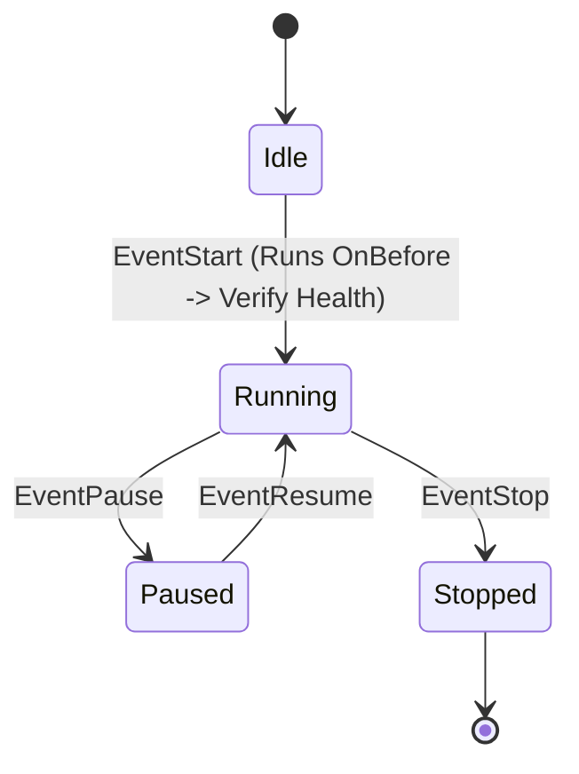

# Finite State Machine (`async/fsm`)

[](https://pkg.go.dev/github.com/lemon4ksan/foundation/async/fsm)

`async/fsm` provides compile-time type-safe, thread-safe finite state machines parameterized over `State` and `Event` generics with transactional before/after hooks and Graphviz DOT export.

## Motivation & Problem Context

Implementing state machines with untyped strings or constants frequently leads to silent transition bugs that the Go compiler cannot catch. In concurrent environments, manual mutex synchronization around state reads and transitions is prone to race conditions. Furthermore, when intermediate state transition actions fail (such as database persistence or external RPC calls), the lack of transactional rollback leaves the system in an inconsistent or partially transitioned state.

## Comparison

### Standard Implementation (String-based, Manual Mutexes, No Rollback)

```go
type RawFSM struct {
    mu      sync.Mutex
    current string
    rules   map[string]map[string]string
}

func (f *RawFSM) Transition(event string) error {
    f.mu.Lock()
    defer f.mu.Unlock()
    to, ok := f.rules[f.current][event]
    if !ok {
        return fmt.Errorf("invalid transition")
    }
    f.current = to
    return nil
}

// Typo compiles fine, fails at runtime
fsm.Transition("statr")
```

### Foundation Implementation (Compile-Time Safe & Transactional)

```go
machine := fsm.NewFSM[State, Event](StateIdle)
machine.AddRules(
    fsm.TransitionRule[State, Event]{From: StateIdle, Event: EventStart, To: StateRunning},
)

// Typo: EventStatr -> Compile Error!
err := machine.Transition(ctx, EventStart)
```

## Architecture & Mechanics



### Transactional Transition Protocol
1. Acquire transition serialization lock (`transMu`).
2. Validate that a transition rule exists from `current` via `event`.
3. Execute `OnBefore` hooks. If any hook returns a non-nil error, the transition is **aborted immediately**, subsequent hooks are skipped, and the state remains unchanged.
4. Acquire write lock (`mu`), update `current` state, release write lock.
5. Execute `OnAfter` hooks.
6. Release transition lock (`transMu`).

## Practical Recipes

### 1. Order Checkout State Machine with Rollback

*Rationale*: E-commerce checkout state machine where payment gateway failures must keep the order in `StateCreated` without corrupting status.

```go
package main

import (
	"context"
	"errors"
	"fmt"

	"github.com/lemon4ksan/foundation/async/fsm"
)

type OrderState int
const (
	StateCreated OrderState = iota
	StatePaid
	StateShipped
	StateCancelled
)

type OrderEvent int
const (
	EventPay OrderEvent = iota
	EventShip
	EventCancel
)

func main() {
	ctx := context.Background()
	orderFSM := fsm.NewFSM[OrderState, OrderEvent](StateCreated)

	orderFSM.AddRules(
		fsm.TransitionRule[OrderState, OrderEvent]{From: StateCreated, Event: EventPay, To: StatePaid},
		fsm.TransitionRule[OrderState, OrderEvent]{From: StatePaid, Event: EventShip, To: StateShipped},
		fsm.TransitionRule[OrderState, OrderEvent]{From: StateCreated, Event: EventCancel, To: StateCancelled},
	)

	// Precondition hook: charge credit card
	orderFSM.OnBefore(EventPay, func(ctx context.Context, from OrderState, ev OrderEvent, to OrderState) error {
		paymentOK := false // Simulated card decline
		if !paymentOK {
			return errors.New("payment declined: insufficient funds")
		}
		return nil
	})

	// Attempt payment
	err := orderFSM.Transition(ctx, EventPay)
	if err != nil {
		fmt.Println("Transition blocked:", err)
	}

	// State safely remained StateCreated
	fmt.Println("Current Order State:", orderFSM.Current())

	// Export Graphviz DOT diagram
	fmt.Println(orderFSM.ToDOT())
}
```
