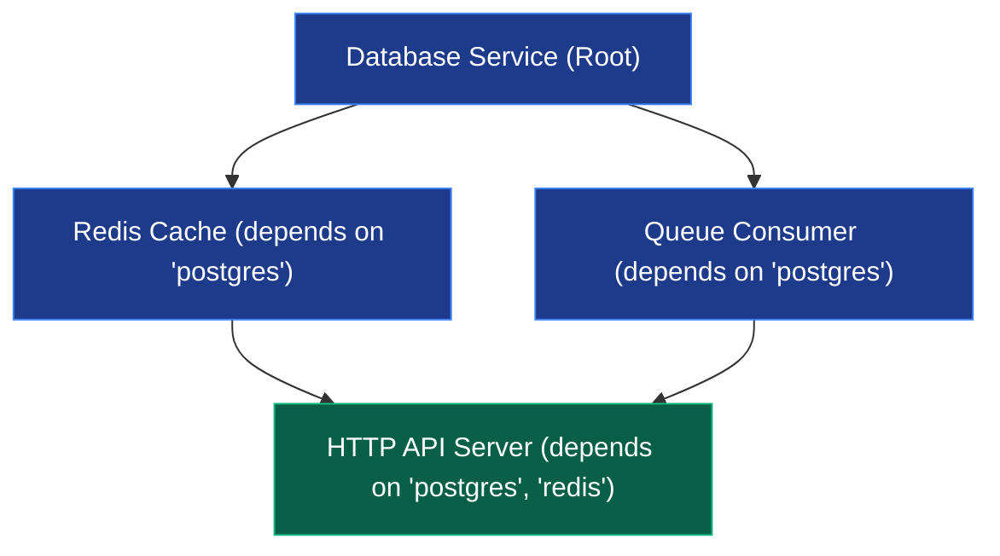

# Service Lifecycle & Background Loops (`async/lifecycle`)

[](https://pkg.go.dev/github.com/lemon4ksan/foundation/async/lifecycle)

`async/lifecycle` provides topological Directed Acyclic Graph (DAG) service orchestration and resilient background loop management with graceful teardown.

## Motivation & Problem Context

When bootstrapping complex microservices with interconnected dependencies, manual sequencing creates fragile initialization code. If an intermediate subsystem fails during startup, previously initialized components (such as database pools or background flushers) are often left running without proper cleanup, leaking system resources and locks. Furthermore, stopping services in an arbitrary order during application shutdown risks serving requests against already-closed downstream dependencies.

## Comparison

### Standard Implementation (Manual Sequencing & Leaked Resources)

```go
// Order hardcoded manually: database -> cache -> server
if err := db.Init(); err != nil {
    log.Fatal(err)
}
if err := cache.Init(); err != nil {
    // Database connection leaked without rollback
    log.Fatal(err)
}
if err := server.Start(); err != nil {
    // Database and cache remain open in orphaned state
    log.Fatal(err)
}

// Manual teardown requiring custom reverse logic
defer func() {
    server.Stop()
    cache.Close()
    db.Close()
}()
```

### Foundation Implementation (Topological DAG & Automatic Rollback)

```go
orch := lifecycle.NewOrchestrator()
orch.Register(NewDBService())
orch.Register(NewCacheService())  // Declares dependency: "postgres"
orch.Register(NewServerService()) // Declares dependencies: "postgres", "redis"

// Automatically resolves topological order: postgres -> redis -> http-server
if err := orch.InitAll(ctx); err != nil {
    log.Fatal(err)
}

// If server fails to start, already-started services rollback in reverse order
if err := orch.StartAll(ctx); err != nil {
    log.Fatal(err)
}

// Guaranteed reverse teardown order: http-server -> redis -> postgres
defer orch.StopAll(context.Background())
```

## Architecture & Mechanics



### Depth-First Search (DFS) Topological Sorter
* **Dependency Resolution**: `Orchestrator` constructs an adjacency graph of all registered `Service` nodes based on their `.Dependencies()` declarations.
* **Cycle Detection**: Detects circular dependencies at registration time and returns `ErrCircularDependency`.
* **Atomic Rollback Stack**: During `StartAll()`, the orchestrator pushes every successfully started service onto an internal LIFO stack. If any service returns an error, the stack unwinds in reverse order, executing `.Stop(ctx)` on each started service.

## Practical Recipes

### 1. Declarative Microservice DAG Startup

*Rationale*: Keeps services modular and decoupled, allowing independent development and deterministic startup.

```go
package main

import (
	"context"
	"fmt"
	"log"
	"time"

	"github.com/lemon4ksan/foundation/async/lifecycle"
)

type Database struct{}
func (d *Database) Name() string { return "postgres" }
func (d *Database) Dependencies() []string { return nil }
func (d *Database) Init(ctx context.Context) error { fmt.Println("1. Postgres initialized"); return nil }
func (d *Database) Start(ctx context.Context) error { fmt.Println("1. Postgres connected"); return nil }
func (d *Database) Stop(ctx context.Context) error { fmt.Println("Postgres disconnected"); return nil }

type RedisCache struct{}
func (r *RedisCache) Name() string { return "redis" }
func (r *RedisCache) Dependencies() []string { return []string{"postgres"} }
func (r *RedisCache) Init(ctx context.Context) error { fmt.Println("2. Redis initialized"); return nil }
func (r *RedisCache) Start(ctx context.Context) error { fmt.Println("2. Redis connected"); return nil }
func (r *RedisCache) Stop(ctx context.Context) error { fmt.Println("Redis disconnected"); return nil }

type HTTPServer struct{}
func (s *HTTPServer) Name() string { return "http-server" }
func (s *HTTPServer) Dependencies() []string { return []string{"postgres", "redis"} }
func (s *HTTPServer) Init(ctx context.Context) error { fmt.Println("3. HTTP routes registered"); return nil }
func (s *HTTPServer) Start(ctx context.Context) error { fmt.Println("3. HTTP listening on :8080"); return nil }
func (s *HTTPServer) Stop(ctx context.Context) error { fmt.Println("HTTP server drained"); return nil }

func main() {
	ctx, cancel := context.WithTimeout(context.Background(), 10*time.Second)
	defer cancel()

	orch := lifecycle.NewOrchestrator()
	orch.Register(&HTTPServer{})
	orch.Register(&RedisCache{})
	orch.Register(&Database{})

	if err := orch.InitAll(ctx); err != nil {
		log.Fatalf("Init failed: %v", err)
	}

	if err := orch.StartAll(ctx); err != nil {
		log.Fatalf("Start failed: %v", err)
	}

	defer orch.StopAll(context.Background())
}
```

### 2. BehaviorRunner for Concurrent Background Loops

*Rationale*: Manages independent background workers (e.g. queue consumers, health probes, metrics flushers) with unified lifecycle tracking and fail-fast cancellation.

```go
type QueueConsumer struct{}
func (q *QueueConsumer) Name() string { return "queue-consumer" }
func (q *QueueConsumer) Run(ctx context.Context) error {
	for {
		select {
		case <-ctx.Done():
			return nil
		default:
			time.Sleep(100 * time.Millisecond)
		}
	}
}

type MetricsTicker struct{}
func (m *MetricsTicker) Name() string { return "metrics-ticker" }
func (m *MetricsTicker) Run(ctx context.Context) error {
	ticker := time.NewTicker(time.Second)
	defer ticker.Stop()
	for {
		select {
		case <-ctx.Done():
			return nil
		case <-ticker.C:
			// Emit metrics
		}
	}
}

func RunBackgroundWorkers(ctx context.Context) {
	runner := lifecycle.NewBehaviorRunner(
		lifecycle.WithFailFast(), // Cancels all workers if one crashes
	)

	runner.Register(&QueueConsumer{})
	runner.Register(&MetricsTicker{})

	runner.Start(ctx)
	defer runner.Stop() // Blocks until all worker goroutines safely finish
}
```
