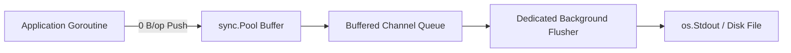

# Structured Logger Facade (`async/logkit`)

[](https://pkg.go.dev/github.com/lemon4ksan/foundation/async/logkit)

`async/logkit` provides an ultra-high-speed structured logging facade with zero memory allocations on hot paths and asynchronous channel-based writer decoupling.

## Motivation & Problem Context

In high-throughput network applications, synchronous disk writes during logkit emission block application worker threads during I/O latency spikes. Formatting structured logkit entries with standard reflection-based loggers generates thousands of heap allocations per second, increasing GC mark-assist overhead. Decoupling logkit serialization through non-blocking buffer channels ensures that logging never interferes with application line-rate throughput.

## Comparison

### Standard Implementation (Synchronous & Allocating)

```go
logger := slog.Default()
logger.Info("user request",
    slog.String("user", "100"),
    slog.Int("status", 200),
)
```

### Foundation Implementation (Asynchronous & Zero-Alloc)

```go
logger := logkit.New(os.Stdout, logkit.LevelDebug)
compLog := logger.With(logkit.Component("auth"))

compLog.Info("user request",
    logkit.String("user", "100"),
    logkit.Int("status", 200),
)
```

## Architecture & Mechanics



* **Zero-Allocation Buffer Pools**: logkit lines are formatted into pooled memory buffers (`sync.Pool`) before being pushed to an asynchronous background worker.
* **Non-Blocking Drop Strategy**: If the queue fills up during disk stalls, logs can be dropped to protect application liveness rather than hanging the system.

## Practical Recipes

### 1. Component-Scoped Subsystem Logging

```go
package main

import (
	"os"

	"github.com/lemon4ksan/foundation/async/logkit"
)

func main() {
	baseLog := logkit.New(os.Stdout, logkit.LevelInfo)

	authLog := baseLog.With(logkit.Component("auth"))
	dbLog := baseLog.With(logkit.Component("postgres"))

	authLog.Info("token verified", logkit.String("sub", "usr_100"))
	dbLog.Warn("slow query detected", logkit.Int("duration_ms", 125))
}
```
