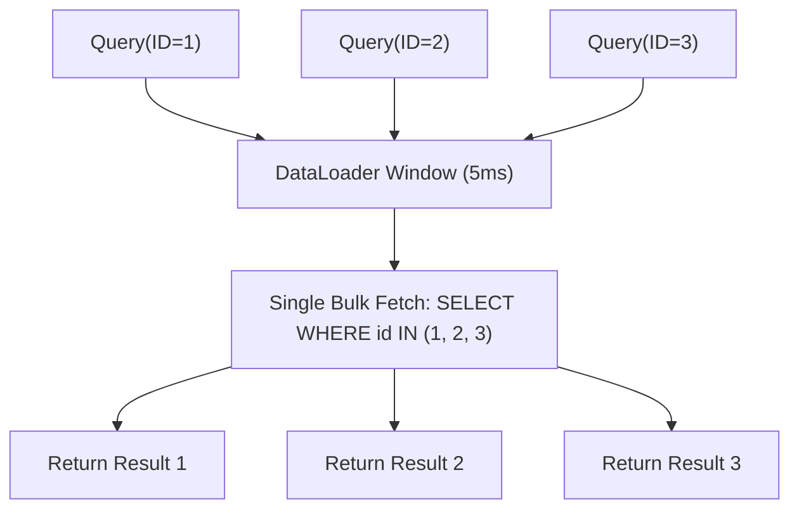

# Concurrent Pipelines & DataLoader (`async/pipeline`)

[](https://pkg.go.dev/github.com/lemon4ksan/foundation/async/pipeline)

`async/pipeline` provides concurrent parallel mapping, worker fan-out/fan-in, token-bucket rate limiting, strict order preservation, and time-window bulk batching (`DataLoader`).

## Motivation & Problem Context

Processing large slices of data concurrently requires careful concurrency budgeting and rate limiting to avoid overwhelming downstream services. Uncoordinated channel fan-out scrambles the original slice ordering, necessitating manual index bookkeeping to reconstruct results. In GraphQL and REST API resolvers, executing individual queries per item inside concurrent loops triggers N+1 query patterns that degrade database throughput.

## Comparison

### Standard Implementation (Manual WaitGroup & Scrambled Order)

```go
results := make([]Result, len(items))
sem := make(chan struct{}, 10)
var wg sync.WaitGroup

for idx, item := range items {
    wg.Add(1)
    sem <- struct{}{}
    go func(i int, it Item) {
        defer wg.Done()
        defer func() { <-sem }()
        r, _ := process(it)
        results[i] = r // Mutex required to prevent data races
    }(idx, item)
}
wg.Wait()
```

### Foundation Implementation (Order-Preserved & Rate-Limited)

```go
results, err := pipeline.Map(ctx, pipeline.PipelineConfig{
    Workers:  10,
    RPS:      250, // Rate-limited to 250 ops/sec
    FailFast: true,
}, items, func(ctx context.Context, it Item) (Result, error) {
    return process(ctx, it)
})
```

## Architecture & Mechanics



### Indexed Parallel Slicing
* `pipeline.Map` allocates the result slice with `len(items)` capacity upfront.
* Worker goroutines pull from an atomic index counter and write directly into their designated slice index without mutex contention.

### Time-Window DataLoader
* `DataLoader` buffers individual keys over a configurable time window (e.g. 5ms).
* When the window timer expires or batch capacity is reached, the batch function is invoked **once** for all accumulated keys, and individual outcomes are distributed back to waiting callers.

## Practical Recipes

### 1. Rate-Limited Bulk API Processing

*Rationale*: Enriching 5,000 records against a third-party API that enforces a strict rate limit of 100 requests/sec.

```go
package main

import (
	"context"
	"fmt"

	"github.com/lemon4ksan/foundation/async/pipeline"
)

type UserID string
type UserProfile struct {
	ID   UserID
	Tier string
}

func main() {
	ctx := context.Background()
	userIDs := []UserID{"u1", "u2", "u3", "u4", "u5"}

	profiles, err := pipeline.Map(ctx, pipeline.PipelineConfig{
		Workers:  5,
		RPS:      100.0, // 100 req/sec limit
		Burst:    10,
		FailFast: true,
	}, userIDs, func(ctx context.Context, id UserID) (UserProfile, error) {
		return UserProfile{ID: id, Tier: "premium"}, nil
	})

	if err != nil {
		panic(err)
	}

	for _, p := range profiles {
		fmt.Printf("User %s is %s\n", p.ID, p.Tier)
	}
}
```

### 2. N+1 Resolver Batching with DataLoader

*Rationale*: Eliminating N+1 database queries in high-concurrency API gateways.

```go
loader := pipeline.NewDataLoader[string, *Price](5*time.Millisecond, func(ctx context.Context, keys []string) (map[string]*Price, error) {
    // Single bulk database query for all keys accumulated in the 5ms window
    return priceDB.GetItemsBulk(ctx, keys)
})

// Called concurrently across 50 goroutines:
price, err := loader.Load(ctx, "sku_420")
```
