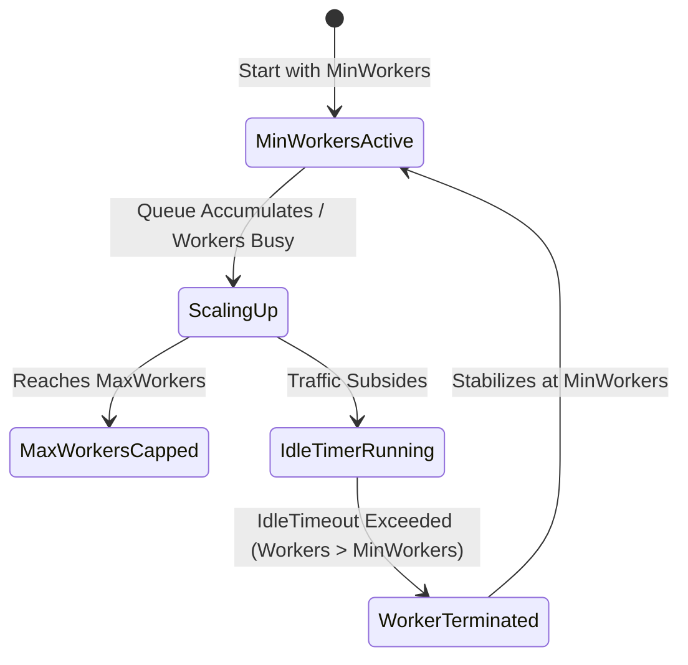

# Auto-Scaling Worker Pool (`async/pool`)

[](https://pkg.go.dev/github.com/lemon4ksan/foundation/async/pool)

`async/pool` provides dynamic, auto-scaling worker pools that scale goroutines under load and scale down to baseline thresholds after periods of idleness, with built-in panic recovery and type-safe `Future[T]` results.

## Motivation & Problem Context

Static worker pools maintain a fixed number of goroutines regardless of workload, consuming system memory during idle periods and bottlenecking throughput during sudden traffic spikes. Additionally, unhandled panics within task functions can terminate worker goroutines permanently, progressively degrading pool capacity. A dynamic worker pool must automatically scale between configured minimum and maximum limits, recover safely from task panics, and provide asynchronous futures for result retrieval.

## Comparison

### Standard Implementation (Static Channel Worker Pool)

```go
type Task struct {
    fn   func()
    done chan error
}
var tasks = make(chan Task, 100)

func init() {
    for i := 0; i < 20; i++ {
        go func() {
            for t := range tasks {
                t.fn() // Panic kills this worker goroutine permanently
            }
        }()
    }
}
```

### Foundation Implementation (Dynamic Auto-Scaling & Future)

```go
p := pool.New[string](pool.Config{
    MinWorkers:  2,
    MaxWorkers:  50,
    IdleTimeout: 10 * time.Second,
    QueueLimit:  1000,
})
defer p.Close()

future, err := p.Submit(ctx, taskFunc)
result, err := future.Get(ctx)
```

## Architecture & Mechanics



### Dynamic Worker Scaling Rules:
1. When `Submit()` is called:
   * If current active workers < `MaxWorkers` AND (all workers are busy OR tasks are queuing), a **new worker goroutine is spawned immediately**.
   * If active workers == `MaxWorkers`, task is queued in the buffered queue.
   * If queue exceeds `QueueLimit`, returns `pool.ErrQueueFull` immediately for fast-path shedding.
2. Worker idle loop:
   * Workers above `MinWorkers` start an idle timer. If no new task is dequeued within `IdleTimeout`, the worker exits cleanly.

## Practical Recipes

### 1. Batch Image Processing Worker Pool

*Rationale*: Scaling up to 16 workers during batch uploads, but keeping only 2 active workers during quiet periods.

```go
package main

import (
	"context"
	"fmt"
	"time"

	"github.com/lemon4ksan/foundation/async/pool"
)

type ProcessedImage struct {
	Width  int
	Height int
	Data   []byte
}

func main() {
	ctx := context.Background()

	imagePool := pool.New[ProcessedImage](pool.Config{
		MinWorkers:  2,
		MaxWorkers:  16,
		IdleTimeout: 5 * time.Second,
		QueueLimit:  200,
	})
	defer imagePool.Close()

	future, err := imagePool.Submit(ctx, func(taskCtx context.Context) (ProcessedImage, error) {
		time.Sleep(20 * time.Millisecond) // Image resizing
		return ProcessedImage{Width: 1920, Height: 1080, Data: []byte("resized")}, nil
	})

	if err != nil {
		panic(err)
	}

	img, err := future.Get(ctx)
	if err != nil {
		panic(err)
	}

	fmt.Printf("Image processed: %dx%d\n", img.Width, img.Height)
}
```
