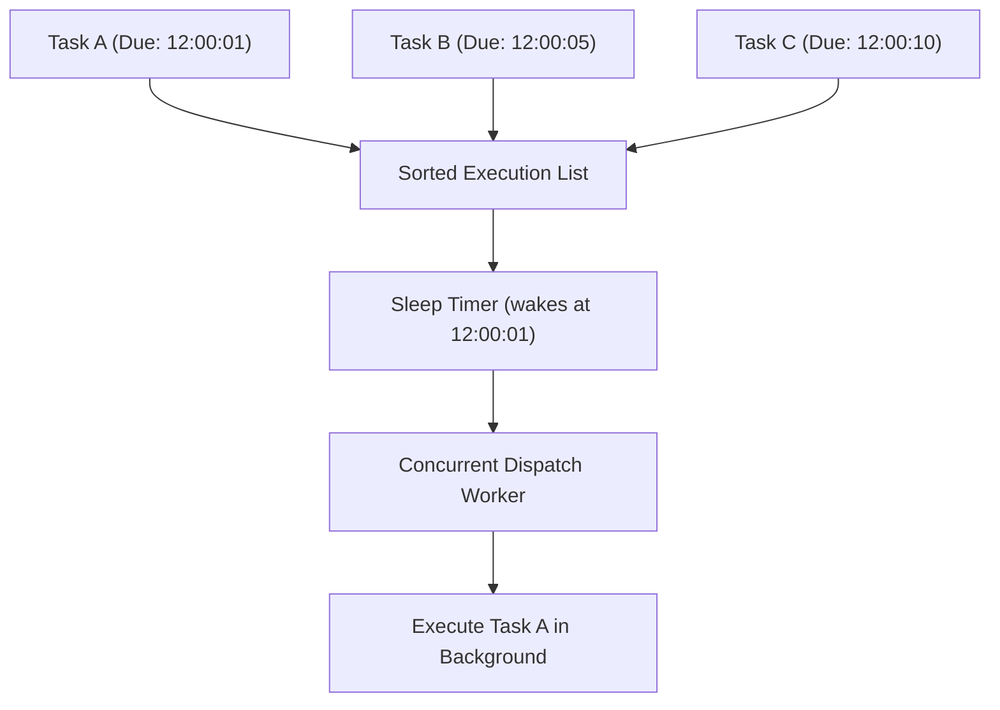

# Task Scheduler & Cron (`async/scheduler`)

[](https://pkg.go.dev/github.com/lemon4ksan/foundation/async/scheduler)

`async/scheduler` maintains microsecond-precision sorted task queues, recurring intervals, and cron-like task execution loops with graceful cancellation.

## Motivation & Problem Context

Managing numerous independent background tasks with individual `time.Ticker` instances introduces timer contention and runtime timer heap churn. Over time, uncoordinated timers drift under CPU load, resulting in unsynchronized task execution and unpredictable resource usage. Coordinating graceful shutdown across dozens of independent timer loops requires complex cancellation bookkeeping.

## Comparison

### Standard Implementation (Individual Tickers & Goroutines)

```go
go func() {
    t := time.NewTicker(time.Second)
    defer t.Stop()
    for {
        select {
        case <-ctx.Done():
            return
        case <-t.C:
            jobA()
        }
    }
}()
```

### Foundation Implementation (Unified Scheduler)

```go
s := scheduler.New()
s.Every(time.Second, jobA)
s.After(5*time.Second, jobB)

s.Start(ctx)
defer s.Stop()
```

## Architecture & Mechanics



* **Sorted Time List**: Tasks are stored ordered by their next execution deadline.
* **Smart Sleep Wake-Up**: The scheduler thread sleeps exactly until the next upcoming task is due, avoiding busy-wait polling.
* **Concurrent Dispatch**: When a task fires, it is spawned onto a concurrent worker so it never delays the scheduler loop.

## Practical Recipes

### 1. Recurring Background Maintenance Jobs

```go
package main

import (
	"context"
	"fmt"
	"time"

	"github.com/lemon4ksan/foundation/async/scheduler"
)

func main() {
	s := scheduler.New()
	defer s.Stop()

	// 1. Recurring cache eviction every 1 minute
	s.Every(time.Minute, func(ctx context.Context) {
		fmt.Println("Running cache eviction at", time.Now())
	})

	// 2. Delayed warm-up query after 5 seconds
	s.After(5*time.Second, func(ctx context.Context) {
		fmt.Println("Warming up database connection pool...")
	})

	ctx, cancel := context.WithCancel(context.Background())
	defer cancel()

	// Start scheduler in background
	go s.Start(ctx)

	time.Sleep(10 * time.Second)
}
```
