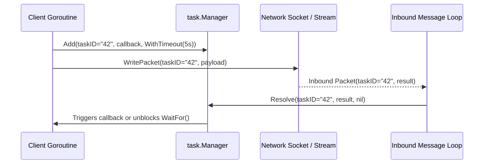

# Correlation-ID Task Manager (`async/task`)

[](https://pkg.go.dev/github.com/lemon4ksan/foundation/async/task)

`async/task` provides thread-safe correlation-ID task tracking, asynchronous callback execution, context-aware timeouts, and non-blocking futures.

## Motivation & Problem Context

Asynchronous network protocols—such as WebSockets, gRPC-Web streams, and message queues—physically decouple request transmission from response reception. Matching incoming response packets to their originating request context requires tracking unique correlation IDs across goroutines. Without centralized deadline tracking and pooled descriptor management, spawning per-request timer goroutines introduces significant scheduler churn and garbage collector overhead under high concurrency.

## Comparison

### Standard Implementation (Manual Map & Unpooled Goroutines)

```go
type Job struct {
    Done chan Response
    Err  error
}
var mu sync.Mutex
var jobs = map[string]*Job{}

func send(id string) (Response, error) {
    j := &Job{Done: make(chan Response, 1)}
    mu.Lock()
    jobs[id] = j
    mu.Unlock()

    go func() {
        select {
        case <-time.After(5 * time.Second):
            mu.Lock()
            delete(jobs, id)
            mu.Unlock()
        }
    }()
    // ...
}
```

### Foundation Implementation (Pooled Zero-Alloc Task Manager)

```go
mgr := task.NewManager[string, Response](10000)
defer mgr.Close()

// Register task with 5-second deadline
err := mgr.Add(id, callback,
    task.WithTimeout[Response](5*time.Second),
    task.WithContext[Response](ctx),
)

// In inbound message loop:
mgr.Resolve(id, responsePayload, nil)
```

## Architecture & Mechanics



* **Pooled Descriptors**: Task descriptors are recycled via `sync.Pool` to eliminate heap allocations per request.
* **Atomic State Transitions**: `.Resolve()` enforces atomic state flags (`pending` -> `resolved` -> `reclaimed`), ensuring that concurrent timeouts and responses never trigger callbacks twice.

## Practical Recipes

### 1. Asynchronous RPC Over WebSockets

*Rationale*: High-throughput event loops where client threads cannot afford to block while waiting for RPC responses.

```go
package main

import (
	"context"
	"fmt"
	"time"

	"github.com/lemon4ksan/foundation/async/task"
)

type RPCResponse struct {
	Result string
}

func main() {
	ctx := context.Background()
	mgr := task.NewManager[uint64, RPCResponse](5000)
	defer mgr.Close()

	reqID := uint64(1042)

	err := mgr.Add(reqID, func(ctx context.Context, res RPCResponse, err error) {
		if err != nil {
			fmt.Printf("RPC Error for ID %d: %v\n", reqID, err)
			return
		}
		fmt.Printf("RPC Succeeded: %s\n", res.Result)
	}, task.WithTimeout[RPCResponse](3*time.Second), task.WithContext[RPCResponse](ctx))

	if err != nil {
		panic(err)
	}

	// Inbound message loop resolves response
	go func() {
		time.Sleep(20 * time.Millisecond)
		mgr.Resolve(reqID, RPCResponse{Result: "data_payload_ok"}, nil)
	}()

	time.Sleep(50 * time.Millisecond)
}
```

### 2. Synchronous REST-to-Async Bridge

*Rationale*: Translating synchronous incoming HTTP calls into asynchronous backend broker requests with timeout enforcement.

```go
func HandleHTTPRequest(ctx context.Context, orderID string) (OrderResult, error) {
	err := orderTaskMgr.Add(orderID, nil, task.WithContext[OrderResult](ctx))
	if err != nil {
		return OrderResult{}, err
	}

	if err := kafkaProducer.Send(orderID); err != nil {
		orderTaskMgr.Resolve(orderID, OrderResult{}, err)
		return OrderResult{}, err
	}

	// Blocks until response arrives or context deadline expires
	return orderTaskMgr.WaitFor(ctx, orderID)
}
```
