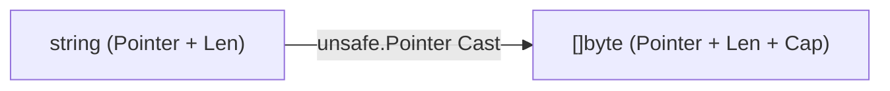

# Zero-Copy Conversions & Slicing (`silicon/bytesconv`)

[](https://pkg.go.dev/github.com/lemon4ksan/foundation/silicon/bytesconv)

`silicon/bytesconv` provides zero-allocation unsafe string-to-byte conversions, high-speed scanners, and slice splitters for performance-critical hot paths.

## Motivation & Problem Context

To guarantee string immutability, the Go runtime allocates a new heap copy on every `string(b)` or `[]byte(s)` conversion. While safe, this behavior produces continuous garbage collector pressure when parsing high-frequency HTTP headers, URL parameters, and protocol frames. Standard library helpers like `strings.Split` compound this overhead by allocating a new slice of string descriptors on every invocation.

## Comparison

### Standard Implementation (Heap Allocations on Every Conversion)

```go
// Copies bytes to heap (1 alloc per string)
str := string(byteSlice)
b := []byte(str)

// strings.Split allocates slice of strings on heap
parts := strings.Split(header, ";")
```

### Foundation Implementation (Zero Allocations)

```go
// Zero-copy pointer reinterpretation (0 B/op)
str := bytesconv.BytesToString(byteSlice)
b := bytesconv.StringToBytes(str)

// Zero-allocation slice tokenization
slicer := bytesconv.NewSlicer(b, ';')
for slicer.Next() {
    chunk := slicer.Bytes()
}
```

## Architecture & Mechanics



* **`unsafe.StringData` & `unsafe.Slice`**: Implemented using modern Go 1.20+ `unsafe.StringData` and `unsafe.Slice` compiler intrinsics.
* **Slicer Iterator**: Maintains a cursor pointer into the underlying byte array, returning subslices without allocating string or slice descriptors on the heap.

## Practical Recipes

### 1. Zero-Alloc HTTP Header Parsing

```go
package main

import (
	"fmt"

	"github.com/lemon4ksan/foundation/silicon/bytesconv"
)

func ParseContentType(header []byte) {
	slicer := bytesconv.NewSlicer(header, ';')

	for slicer.Next() {
		token := bytesconv.TrimSpace(slicer.Bytes())
		fmt.Println("Header token:", bytesconv.BytesToString(token))
	}
}

func main() {
	header := []byte("application/json; charset=utf-8; boundary=something")
	ParseContentType(header)
}
```
