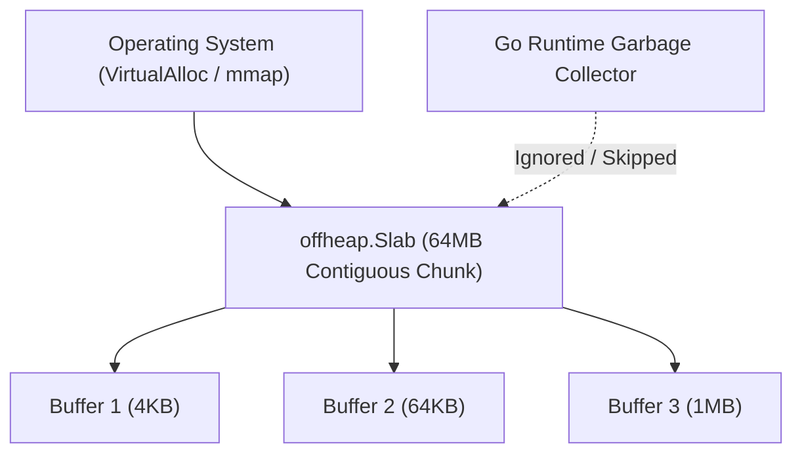

# Unmanaged Memory Slabs (`silicon/offheap`)

[](https://pkg.go.dev/github.com/lemon4ksan/foundation/silicon/offheap)

`silicon/offheap` provides unmanaged direct memory allocation and slab allocators bypassing the Go Garbage Collector (GC) to eliminate Stop-The-World latency spikes under multi-gigabyte memory footprints.

## Motivation & Problem Context

Maintaining hundreds of megabytes of cached network packets, proxy buffers, or long-lived protocol state on the Go runtime heap forces the garbage collector to traverse large pointer graphs on every GC cycle. This traversal introduces unpredictable Stop-The-World latency spikes and causes heap fragmentation. Allocating raw memory outside the Go heap eliminates GC scan overhead and provides deterministic memory lifecycle control.

## Comparison

### Standard Implementation (GC Scanned Heap)

```go
cache := make([][]byte, 1000000)
for i := range cache {
    cache[i] = make([]byte, 4096)
}
// GC scan time: ~15-50ms every GC cycle
```

### Foundation Implementation (Invisible to GC)

```go
slab := offheap.NewSlab(64 * 1024 * 1024) // 64MB direct slab
defer slab.Free()

buf, _ := slab.Alloc(4096)
// GC scan time: 0.00ms
```

## Architecture & Mechanics



* **OS-Level Virtual Memory**: Allocates contiguous memory pages directly via OS virtual memory APIs without registering pointers in the Go runtime heap.
* **Deterministic Lifetime**: Freeing a slab returns virtual pages directly to the OS or resets the bump allocator with zero GC interference.

## Practical Recipes

### 1. High-Throughput Packet Ring Buffer

```go
package main

import (
	"fmt"

	"github.com/lemon4ksan/foundation/silicon/offheap"
)

func main() {
	slab := offheap.NewSlab(32 * 1024 * 1024) // 32MB
	defer slab.Free()

	packetBuf, err := slab.Alloc(1500)
	if err != nil {
		panic(err)
	}

	copy(packetBuf, []byte("raw ethernet packet payload"))
	fmt.Printf("Off-heap packet stored: %s\n", packetBuf[:27])
}
```
