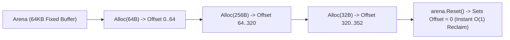

# Memory Arenas & Perpetual Storage (`silicon/pool`)

[](https://pkg.go.dev/github.com/lemon4ksan/foundation/silicon/pool)

`silicon/pool` provides high-performance memory arenas, perpetual byte storages, and tiered object pools for zero-allocation byte handling.

## Motivation & Problem Context

Standard `sync.Pool` objects are subject to reclamation by the Go runtime during garbage collection cycles, causing periodic allocation spikes immediately following a collection. Furthermore, network protocol parsers that allocate numerous small metadata chunks per frame incur high per-object allocation overhead. Contiguous memory arenas allow allocating many small objects in a single contiguous block with instant O(1) reclamation via pointer reset.

## Comparison

### Standard Implementation (100+ Allocations per Request)

```go
type Frame struct {
    Headers []byte
    Body    []byte
    Meta    []byte
}

f := &Frame{
    Headers: make([]byte, 64),
    Body:    make([]byte, 256),
    Meta:    make([]byte, 32),
}
```

### Foundation Implementation (1 Arena Allocation, 0 per Item)

```go
arena := pool.NewArena(64 * 1024)
defer arena.Reset()

headers := arena.Alloc(64)
body := arena.Alloc(256)
meta := arena.Alloc(32)
```

## Architecture & Mechanics



* **Bump Pointer Allocation**: Allocates memory by incrementing an offset integer (`offset += size`) in less than 2 nanoseconds.
* **O(1) Instant Reclaim**: Resetting the arena sets the offset back to 0 without freeing individual chunks.

## Practical Recipes

### 1. Protocol Frame Decoder with Arenas

```go
package main

import (
	"fmt"

	"github.com/lemon4ksan/foundation/silicon/pool"
)

func ProcessFrame(raw []byte) {
	arena := pool.NewArena(64 * 1024)
	defer arena.Reset()

	headerBuf := arena.Alloc(len(raw) / 2)
	copy(headerBuf, raw[:len(raw)/2])

	fmt.Printf("Parsed header chunk (%d bytes)\n", len(headerBuf))
}

func main() {
	ProcessFrame([]byte("GET /index.html HTTP/1.1\r\nHost: example.com\r\n\r\n"))
}
```
