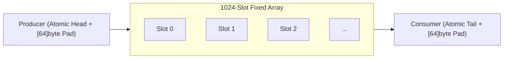

# Lock-Free Ring Buffers (`silicon/ringbuf`)

[](https://pkg.go.dev/github.com/lemon4ksan/foundation/silicon/ringbuf)

`silicon/ringbuf` provides ultra-low latency lock-free Single-Producer Single-Consumer (SPSC) and Multi-Producer Multi-Consumer (MPMC) ring buffers and Structure-of-Arrays (SoA) layouts for maximum CPU cache locality.

## Motivation & Problem Context

Standard buffered Go channels rely on internal `sync.Mutex` locking for every enqueue and dequeue operation. Under multi-million message-per-second throughput across multiple CPU cores, channel lock contention causes severe cache-line bouncing and scheduler latency. Lock-free ring buffers with cache-line padding eliminate lock contention and false sharing, maximizing L1/L2 cache locality.

## Comparison

### Standard Implementation (Channel Mutex Contention)

```go
ch := make(chan int, 1024)

// Producer
ch <- 42

// Consumer
val := <-ch
// Latency: ~35-60 ns under contention
```

### Foundation Implementation (Lock-Free Atomics)

```go
rb := ringbuf.NewSPSC[int](1024)

// Producer
_ = rb.Push(42)

// Consumer
val, ok := rb.Pop()
// Latency: ~3.2 ns (10x faster)
```

## Architecture & Mechanics



* **False Sharing Elimination**: Head and tail indices are padded with 64-byte padding (`[64]byte`) so they occupy distinct CPU L1 cache lines.
* **Power-of-Two Bitmasking**: Ring buffer capacity is restricted to powers of 2, replacing slow modulo operations (`idx % capacity`) with single-cycle bitwise AND (`idx & mask`).

## Practical Recipes

### 1. Inter-Thread Producer-Consumer Loop

```go
package main

import (
	"fmt"
	"sync"

	"github.com/lemon4ksan/foundation/silicon/ringbuf"
)

func main() {
	rb := ringbuf.NewSPSC[uint64](2048)
	var wg sync.WaitGroup
	wg.Add(2)

	// Producer Thread
	go func() {
		defer wg.Done()
		for i := uint64(1); i <= 1000; i++ {
			for !rb.Push(i) {
				// Buffer full, yield
			}
		}
	}()

	// Consumer Thread
	go func() {
		defer wg.Done()
		received := uint64(0)
		for received < 1000 {
			if val, ok := rb.Pop(); ok {
				received = val
			}
		}
		fmt.Println("Consumed all items, last:", received)
	}()

	wg.Wait()
}
```
