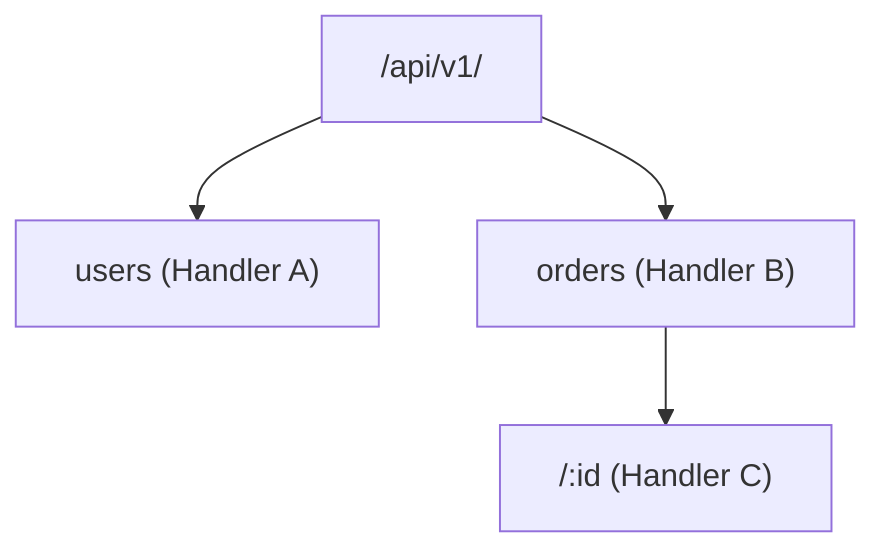

# Radix Prefix Search Trees (`silicon/trie`)

[](https://pkg.go.dev/github.com/lemon4ksan/foundation/silicon/trie)

`silicon/trie` provides zero-allocation radix and prefix search trees for high-speed URL routing, header matching, and domain wildcard lookups.

## Motivation & Problem Context

Standard hash maps (`map[string]T`) only support exact key lookups. Evaluating wildcard domain routes or longest URL path prefixes requires linear scans across all registered routes, taking O(N) time. Matching routes with regular expressions introduces heavy CPU overhead and dynamic memory allocations. Compressed radix search trees provide deterministic O(K) lookups where K is the path length, with zero heap allocations.

## Comparison

### Standard Implementation (Linear Scan / Regex)

```go
for _, pattern := range patterns {
    if match(pattern, url) {
        return handle()
    }
}
// Time complexity: O(N) where N is number of routes
```

### Foundation Implementation (Radix Trie Lookup)

```go
tree := trie.New[Handler]()
tree.Insert("/api/v1/users", userHandler)
tree.Insert("/api/v1/orders", orderHandler)

handler, ok := tree.LookupLongestPrefix(pathBytes)
// Time complexity: O(K) where K is path length, 0 B/op
```

## Architecture & Mechanics



* **Compressed Edges**: Common prefixes share single edge arrays to minimize memory footprint.
* **Byte-Slice Keying**: Lookups accept `[]byte` directly without requiring `string` heap allocation conversions.

## Practical Recipes

### 1. High-Speed URL Path Prefix Router

```go
package main

import (
	"fmt"

	"github.com/lemon4ksan/foundation/silicon/trie"
)

type RouteHandler string

func main() {
	router := trie.New[RouteHandler]()

	router.Insert("/api/v1/auth", "AuthHandler")
	router.Insert("/api/v1/users", "UsersHandler")
	router.Insert("/static", "StaticFileHandler")

	path := []byte("/api/v1/users/42/profile")
	handler, matchedLen, ok := router.LookupLongestPrefix(path)

	if ok {
		fmt.Printf("Matched route: %s (prefix len: %d)\n", handler, matchedLen)
	}
}
```
